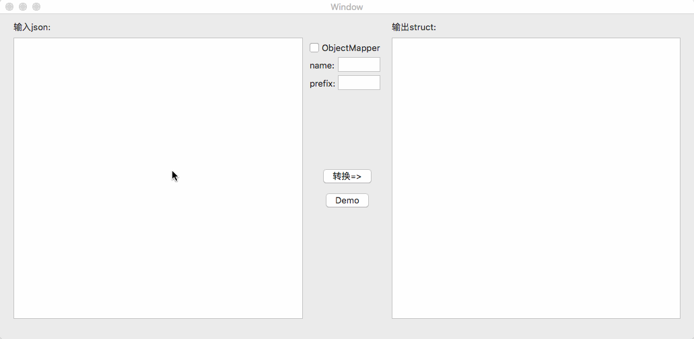

# json2swift

auto convert json string to swift struct.[中文介绍](./Document/README_chs.md)




***

- How to use?

   [OS X app](https://pan.baidu.com/s/1skW4Jxj)

  - 1. Input json to left

  - 2. click "convert=>"

  - 3. Copy the result
      Parameters statement:

    -  [ObjectMapper](https://github.com/Hearst-DD/ObjectMapper): Simple JSON Object mapping written in Swift. If this is selected, result will auto add func mapping

    -  name: the name of the result, default is "Result"

    -  prefix: the prefix of each struct name, default is empty.


  [python script](./script)

   - 1. open Terminal, cd to Main.py

   - 2. Copy json string to File named "jsons.txt"

   - 3. Python3 Main.py

   - 4. ResultModel.swift is the result

   

***

## Other
[CocoaPython](./json2Swift/CocoaPython.swift): a fast way to use python with Cocoa.
we can use CocoaPython.swift like this:
```swift
// python path
guard let aPath = Bundle.main.path(forResource: "Parse", ofType: "py") else { return }

// args: python accept paras
// block: complete block
let script = CocoaPython(scrPath: aPath, args: [""]) { [weak self] in
    print($0) // python's return
    print($1) // python's Error
}

script.spliPara = "$" // the multi results's split Character, if not set, all the results is in result[0]. 
script.runAsync()
// or script.runAsync(asyncComlete: false) // the complete block call in global async
// or script.runSync() // run in current thread
```

***
## Reference

- python 简单入门指北
- [Python教程](https://www.liaoxuefeng.com/wiki/0014316089557264a6b348958f449949df42a6d3a2e542c000)
- [Running a Python Script from Swift](http://martinhoeller.net/running-a-python-script-from-swift/)

